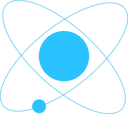

# Titanium Facebook-POP Module

Tipop is a titanium client for [facebook pop](https://github.com/facebook/pop), the rock star animation engine written for iOS / OS X. pop supports both static and dynamic animations, which makes the UI interactions more realistic.
 
In addition to the linear and basic ease-in-out functions, tipop adds another 24 easing function supports  like quad, cubic or expo. The API is similar to the one that Ti.UI.Animation has, which we Ti-Devs must be familiar with.

****Built for Titanium 3.4.0.GA by default.***

<div style='text-align:center;'>

</div>


## Installation

Git-cloning the repository, unzip the `guy.mcdooooo.tipop-iphone-1.0.0.zip` package and put the `modules/iphone/guy.mcdooooo.tipop` into the `modules/iphone` folder of your project. 


## Usage

###1. Accessing Tipop

To access this module from JavaScript, you would do the following:

```javascript
var POP = require("guy.mcdooooo.tipop");
```

The POP variable is a reference to the Module object.

###2. Function list

|   | Basic Animation              | Spring Animation | Decay Animation |
|:-----------:|:------------------------------:|:------------------:|:-----------------:|
|**Properties**|POP.***basic***( myView, `{`|POP.***spring***( myView, `{`|POP.***decay***( myView,` {`|
|left|left: 140;<br>left: 65%;|left: 140;<br>left: 65%;|left: -20;<br><font color='#ccc'>// velocity</font>|
|top|top: -50;<br>top: 15%;|top: -50;<br>top: 15%;|top: 90;<br><font color='#ccc'>// velocity</font>|
|width|width: 100;<br>width: 30%;|width: 100;<br>width: 30%;|width: -40;<br><font color='#ccc'>// velocity</font>|
|height|height: 42;<br>height: 26%;|height: 42;<br>height: 26%;|height: 25;<br><font color='#ccc'>// velocity</font>|
|center|center: {|center: {|center: {|
|center.x|x:160;<br>x:'5%';|x:160;<br>x:'5%';|x:-290;<br><font color='#ccc'>// velocity</font>|
|center.y|y:420;<br>y:'4%';|y:160;<br>y:'4%';|y:-530;<br><font color='#ccc'>// velocity</font>|
||}<font color='#fff'>;;;;;;;;;;;;;</font>|}<font color='#fff'>;;;;;;;;;;;;;</font></font>|}<font color='#fff'>;;;;;;;;;;;;;</font>|
|opacity|opacity: 0.7;|opacity: 0.7;|opacity: -1.8;<br><font color='#ccc'>// velocity</font>|
|zIndex|zIndex: 20;|zIndex: 20;|\|
|color<br>*<font color='#ccc'>Ti.UI.Label</font>*|color: '#FFD3E0';|color: '#FFD3E0';<br>|\|
|backgroundColor|backgroundColor: '#FFD3E0';<br>|backgroundColor: '#FFD3E0';|\|
|tintColor|tintColor: '#55EFCB';<br>|tintColor: '#55EFCB';|\|
|borderRadius|borderRadius: 75;<br>|borderRadius: 75;|borderRadius: -68;<br><font color='#ccc'>// velocity</font>|
|borderWidth|borderWidth: 15;<br>|borderWidth: 15;|borderWidth: -22;<br><font color='#ccc'>// velocity</font>|
|borderColor|borderColor: '#FFD3E0';<br>|borderColor: '#FFD3E0';|\|
|shadowColor|shadowColor: '#CCCCCC';<br>|shadowColor: '#CCCCCC';|\|
|shadowOpacity|shadowOpacity: 0.4;|shadowOpacity: 0.4;|shadowOpacity: -0.8;<br><font color='#ccc'>// velocity</font>|
|rotate|rotate: {|rotate: {|rotate: {|
|rotate.x|x:80;<br><font color='#ccc'>// angle</font>|x:80;<br><font color='#ccc'>// angle</font>|x:-190;<br><font color='#ccc'>// angle, yet velocity</font>|
|rotate.y|y:-35;<br><font color='#ccc'>// angle</font>|y:-35;<br><font color='#ccc'>// angle</font>|y:120;<br><font color='#ccc'>// angle, yet velocity</font>|
|rotate.z|z:20;<br><font color='#ccc'>// angle</font>|z:20;<br><font color='#ccc'>// angle</font>|z:-40;<br><font color='#ccc'>// angle, yet velocity</font>|
||}<font color='#fff'>;;;;;;;;;;;</font>|}<font color='#fff'>;;;;;;;;;;;</font></font>|}<font color='#fff'>;;;;;;;;;;;</font>|
|scale|scale: {|scale: {|scale: {|
|scale.x|x:2.5;|x:2.5;|x:-10;<br><font color='#ccc'>// velocity</font>|
|scale.y|y:-3.5;|y:-3.5;|y:1.2;<br><font color='#ccc'>// velocity</font>|
||}<font color='#fff'>;;;;;;;;;;;</font>|}<font color='#fff'>;;;;;;;;;;;</font></font>|}<font color='#fff'>;;;;;;;;;;;</font>|
|translate|translate: {|translate: {|translate: {|
|translate.x|x:30;|x:30;|x:-10;<br><font color='#ccc'>// velocity</font>|
|translate.y|y:-10;|y:-10;|y:200;<br><font color='#ccc'>// velocity</font>|
|translate.z|z:75;|z:75;|z:-120;<br><font color='#ccc'>// velocity</font>|
||}<font color='#fff'>;;;;;;;;;;;;;</font>|}<font color='#fff'>;;;;;;;;;;;;;</font></font>|}<font color='#fff'>;;;;;;;;;;;;;</font>|
|subTranslate|subTranslate: {|subTranslate: {|subTranslate: {|
|subTranslate.x|x:80;|x:80;|x:-50;<br><font color='#ccc'>// velocity</font>|
|subTranslate.y|y:-15;|y:-15;|y:10;<br><font color='#ccc'>// velocity</font>|
||}<font color='#fff'>;;;;;;;;;;;;;;;;;;;;;</font>|}<font color='#fff'>;;;;;;;;;;;;;;;;;;;;;</font></font>|}<font color='#fff'>;;;;;;;;;;;;;;;;;;;;;</font>|
|scrollViewContentOffset<br><font color='#ccc'>Ti.UI.ScrollView</font>|scrollViewContentOffset: {|scrollViewContentOffset: {|scrollViewContentOffset: {|
|scrollViewContentOffset.x|x:72;|x:72;|x:-155;<br><font color='#ccc'>// velocity</font>|
|scrollViewContentOffset.y|y:-500;|y:-500;|y:188;<br><font color='#ccc'>// velocity</font>|
||}<font color='#fff'>;;;;;;;;;;;;;;;;;;;;;;;;;;;;;;;;;;;;;</font>|}<font color='#fff'>;;;;;;;;;;;;;;;;;;;;;;;;;;;;;;;;;;;;;</font></font>|}<font color='#fff'>;;;;;;;;;;;;;;;;;;;;;;;;;;;;;;;;;;;;;</font>|
|===|
|**Options**|
|duration|duration: 1030|\\|\|
|easing|easing: <font color='#aaa'>'default'</font>;<br>easing: <font color='#aaa'>'linear'</font>;<br><br>easing: <font color='#aaa'>'easeIn'</font>;<br>easing: <font color='#aaa'>'easeOut'</font>;<br>easing: <font color='#aaa'>'easeInOut'</font>;<br><br>easing: <font color='#aaa'>'easeInSine'</font>;<br>easing: <font color='#aaa'>'easeOutSine'</font>;<br>easing: <font color='#aaa'>'easeInOutSine'</font>;<br><br>easing: <font color='#aaa'>'easeInQuad'</font>;<br>easing: <font color='#aaa'>'easeOutQuad'</font>;<br>easing: <font color='#aaa'>'easeInOutQuad'</font>;<br><br>easing: <font color='#aaa'>'easeInCubic'</font>;<br>easing: <font color='#aaa'>'easeOutCubic'</font>;<br>easing: <font color='#aaa'>'easeInOutCubic'</font>;<br><br>easing: <font color='#aaa'>'easeInQuart'</font>;<br>easing: <font color='#aaa'>'easeOutQuart'</font>;<br>easing: <font color='#aaa'>'easeInOutQuart'</font>;<br><br>easing: <font color='#aaa'>'easeInQuint'</font>;<br>easing: <font color='#aaa'>'easeOutQuint'</font>;<br>easing: <font color='#aaa'>'easeInOutQuint'</font>;<br><br>easing: <font color='#aaa'>'easeInExpo'</font>;<br>easing: <font color='#aaa'>'easeOutExpo'</font>;<br>easing: <font color='#aaa'>'easeInOutExpo'</font>;<br><br>easing: <font color='#aaa'>'easeInCirc'</font>;<br>easing: <font color='#aaa'>'easeOutCirc'</font>;<br>easing: <font color='#aaa'>'easeInOutCirc'</font>;<br><br>easing: <font color='#aaa'>'easeInBack'</font>;<br>easing: <font color='#aaa'>'easeOutBack'</font>;<br>easing: <font color='#aaa'>'easeInOutBack'</font>;<br>|\\|\|
|springBounciness<br><font color='#ccc'>value between 0-20 default at 4</font>|\\|springBounciness: 14;|\\|
|springSpeed<br><font color='#ccc'>value between 0-20 default at 4</font>|\\|springSpeed: 3;|\\|
|tension|\\|tension: 10;|\\|
|friction|\\|friction: 4;|\\|
|mass|\\|mass: 20;|\\|
|deceleration<br><font color='#ccc'>range of 0 to 1</font>|\\|\\|deceleration: 0.882;|
|delay|delay: 900;|delay: 900;|delay: 900;|
|repeatCount|repeatCount: 3;|repeatCount: 3;|repeatCount: 3;|
|addictive|addictive: true;<br><font color='#ccc'> // or false</font>|addictive: true;<br><font color='#ccc'> // or false</font>|addictive: true;<br><font color='#ccc'> // or false</font>|
|repeatForever|repeatForever: true;<br><font color='#ccc'> // or false</font>|repeatForever: true;<br><font color='#ccc'> // or false</font>|repeatForever: true;<br><font color='#ccc'> // or false</font>|
|autoreverse|autoreverse: true;<br><font color='#ccc'> // or false</font>|autoreverse: true;<br><font color='#ccc'> // or false</font>|autoreverse: true;<br><font color='#ccc'> // or false</font>|
||`});`<font color='#fff'>;;;;;;;;;;;;;;;;;;;;;;;;;;;;;;;;;</font>|`});`<font color='#fff'>;;;;;;;;;;;;;;;;;;;;;;;;;;;;;;;;;</font>|`});`<font color='#fff'>;;;;;;;;;;;;;;;;;;;;;;;;;;;;;;;;;</font>|

Beside, you could use `POP.clear(myView)` to remove all the pop animations attached to `myView`, and it could be chained with basic, spring or decay mehtods.

```javascript
POP
.clear(myView)
.spring(myView, {
    ...
});
```


## Author

- [@McDo](https://github.com/McDo)

- email: [mcdooooo@gmail.com](mcdooooo@gmail.com)

- twitter: [do109](https://twitter.com/do109)
